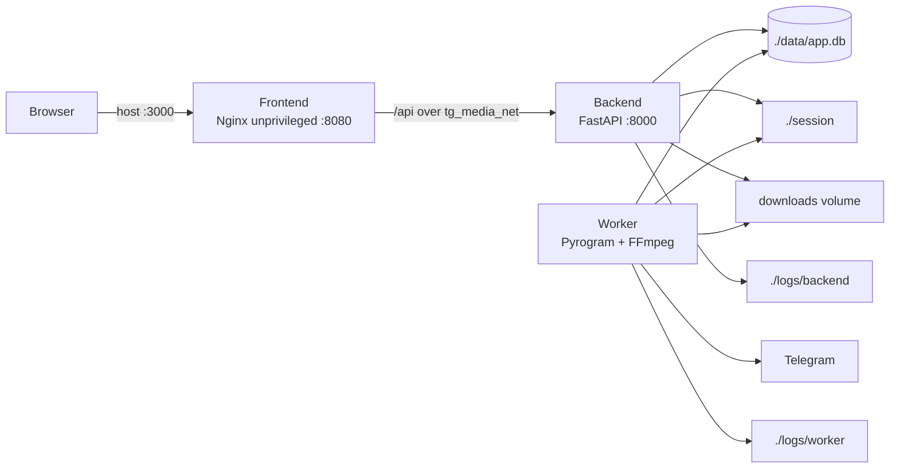

# Docker Architecture



## Images

- `telegram-media-python`: one immutable, non-root image shared by backend and
  worker. It contains `/app/backend/app` and `/app/worker`.
- `telegram-media-frontend`: multi-stage Vue build served by
  `nginx-unprivileged` on port 8080.

Sharing the Python image avoids duplicated dependency stacks while allowing
independent commands, limits, healthchecks, and lifecycle policies.

## Runtime paths

| Container path | Host source | Consumers | Purpose |
| --- | --- | --- | --- |
| `/app/data` | `./data` | Backend, worker | SQLite DB and runtime hash index |
| `/app/session` | `./session` | Backend, worker | Telegram session state |
| `/app/downloads` | `${DOWNLOADS_VOLUME}` | Backend, worker | Downloaded media |
| `/app/logs` | service-specific log folder | Backend, worker | Application file logs |
| `/tmp` | tmpfs | All services | Bounded ephemeral files |

The image contains `/downloads -> /app/downloads` only for compatibility with
existing database records. New deployment configuration uses `/app/downloads`.

## Network boundary

- Only frontend publishes a port by default.
- Backend is reachable only as `http://backend:8000` on `tg_media_net`.
- Worker publishes no ports and retains outbound access required by Telegram.
- To expose the backend locally for diagnostics:

  ```bash
  docker compose -f docker-compose.yml -f docker-compose.api.yml up -d
  ```

  The override binds to `127.0.0.1` unless `BACKEND_BIND_ADDRESS` is changed.

## Lifecycle

- `init: true` supplies one init mechanism and forwards signals.
- Backend/frontend have a 30-second grace period; worker has two minutes for
  active downloads.
- Frontend and worker wait for backend health before startup.
- Worker health is process-level only in Phase 1; a real heartbeat is deferred.
