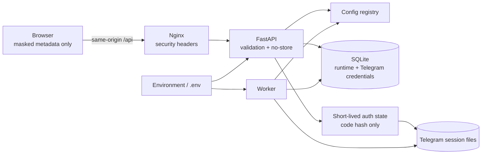

# Phase 2 Security Architecture

## Trust boundaries

- The browser receives masked credential metadata, never credential values or
  session paths/content.
- Nginx is the only published service. Backend and worker stay on the Phase 1
  private bridge network.
- Bootstrap configuration comes from environment/Docker and requires restart.
- Runtime and Telegram configuration may be stored in SQLite. Dedicated APIs
  validate and atomically update them.
- Verification codes and 2FA passwords exist only as request/function values.
  The Telegram phone-code hash exists only for the active authorization flow.
- Session files are high-value credentials mounted from the host and excluded
  from Git, images and HTTP download routes.
- Optional admin write protection covers every `/api` POST, PUT, PATCH and
  DELETE request. Read-only media GET requests remain available.

## Defense layers

1. Registry classification and validation.
2. Serializer masking and Settings API allow-listing.
3. Write-only secret update semantics.
4. In-memory auth/config rate limiting.
5. Central log/error sanitization.
6. `no-store` on credential/auth responses.
7. Non-root containers, explicit volumes, resource limits and network boundary
   retained from Phase 1.

This is a single-user NAS security model. It does not claim multi-tenant
isolation or replace a reverse proxy with TLS when exposed outside a trusted
LAN.
